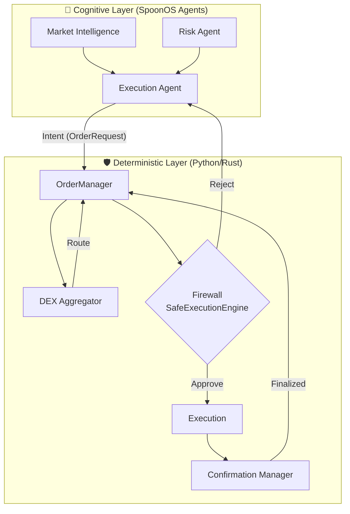

# 🤖 DeFi AI Trading Bot

An intelligent multi-chain DeFi trading bot powered by SpoonOS Agent Framework, featuring AI-driven market analysis, risk assessment, and automated trade execution.

## Demo Video

🎥 **Project Demo:** [An intelligent multi-chain DeFi trading bot – Live Demo](https://vimeo.com/1110142910?share=copy)


## 🌟 Features

- **🧠 AI Market Intelligence**: Real-time multi-chain opportunity scanning
- **🛡️ Deterministic Firewall**: Rigid checks on Solvency, Slippage, and Whitelists (Zero AI Hallucinations)
- **✅ Confirmation Manager**: Preventing "Ghost Trades" by waiting for block finality
- **⚠️ Risk Assessment**: Advanced AI-powered risk analysis and portfolio optimization
- **🚀 Smart Execution**: Optimal DEX aggregation and MEV-protected trading
- **📊 Position Management**: Automated stop-loss, take-profit, and portfolio tracking
- **⛽ Gas Optimization**: Intelligent gas pricing and transaction timing
- **🌐 Multi-Chain Support**: Ethereum, Polygon, BSC, Arbitrum

## 🏗️ Architecture

The bot uses a novel **Dual-Layer "Hybrid Intelligence" Architecture** powered by SpoonOS. This design solves the "hallucination problem" by separating AI decision-making from high-stakes execution.

### 🧠 Layer 1: The Cognitive Brain (SpoonOS Agents)
*   **Role**: Strategy, Intent, and Adaptation.
*   **Components**: `Market Intelligence Agent`, `Risk Assessment Agent`, `Execution Manager Agent`.
*   **Function**: Consumes market data, news, and graphs to form an *intent* (e.g., "Accumulate ETH"). It hands off structured requests to the Body.

### 🛡️ Layer 2: The Deterministic Body (Execution Engine)
*   **Role**: Validation, Routing, Execution, and Finality.
*   **Components**:
    *   **`OrderManager`**: The central nervous system that orchestrates the workflow.
    *   **`SafeExecutionEngine` (The Firewall)**: A rigid Python/Rust sandbox that validates every trade against `config.json` whitelists, solvency checks, and risk caps. **If the AI requests a dangerous trade, the Firewall kills it.**
    *   **`ConfirmationManager`**: Tracks transaction finality (block confirmations) to ensure trades are irreversible before updating state.



### Future Optimization: Rust Engine 🦀
The `rust-engine/` directory contains a prototype of the execution layer rewritten in Rust for microsecond latency and type-safe financial operations.

## 🚀 Quick Start

### Prerequisites

- Python 3.10+
- Node.js 16+ (for some MCP tools)
- Git

### Installation

1. **Clone the repository**
```bash
git clone https://github.com/CodeKage25/defi-ai-trading-bot.git
cd defi-ai-trading-bot
```

2. **Set up virtual environment**
```bash
python -m venv venv
source venv/bin/activate  # On Windows: venv\Scripts\activate
```

3. **Install dependencies**
```bash
pip install -r requirements.txt
```

4. **Configure environment variables**
```bash
cp config/.env.example .env
# Edit .env with your API keys and wallet details
```

5. **Install the package**
```bash
pip install -e .
```

### Configuration

1. **Set up API keys** in `.env`:
```bash
# LLM APIs
OPENAI_API_KEY=sk-your-openai-key
ANTHROPIC_API_KEY=sk-your-anthropic-key

# Blockchain
PRIVATE_KEY=0x1234567890abcdef...
ETHEREUM_RPC_URL=https://eth-mainnet.alchemyapi.io/v2/your-key

# Data providers
CHAINBASE_API_KEY=your-chainbase-key
COINGECKO_API_KEY=your-coingecko-key
```

2. **Review configuration** in `config/config.json`:
```bash
defi-bot config
```

## 💻 Usage

### CLI Commands

#### Market Analysis
```bash
# Scan all supported chains
defi-bot scan

# Scan specific chains and tokens
defi-bot scan -c ethereum -c polygon -t ETH -t USDC
```

#### Risk Assessment
```bash
# Assess risk for a strategy
defi-bot risk "ETH/USDC arbitrage" 1000

# Risk assessment with specific tokens
defi-bot risk "Yield farming" 5000 -t ETH -t USDC
```

#### Trade Execution
```bash
# Execute a simple trade
defi-bot trade ETH USDC 1.5 --chain ethereum

# Trade with custom slippage
defi-bot trade BTC ETH 0.1 --chain ethereum --slippage 0.005
```

#### Position Management
```bash
# Monitor active positions
defi-bot positions

# View portfolio dashboard
defi-bot dashboard
```

#### Strategy Execution
```bash
# Run arbitrage strategy
defi-bot strategy arbitrage --amount 1000 -c ethereum -c polygon

# Run yield farming strategy
defi-bot strategy yield_farming --amount 5000 -c ethereum

# Run with custom config
defi-bot strategy dca --config strategies/conservative_dca.json
```

#### System Status
```bash
# Check system status
defi-bot status

# View configuration
defi-bot config
```

### Interactive Dashboard

Launch the real-time dashboard:

```bash
defi-bot dashboard --refresh 30
```

Features:
- Real-time portfolio tracking
- Active position monitoring
- Strategy performance metrics
- Market opportunity alerts

## 🔧 Advanced Usage

### Custom Strategy Configuration

Create a strategy configuration file:

```json
{
  "strategy": "arbitrage",
  "parameters": {
    "chains": ["ethereum", "polygon"],
    "tokens": ["ETH", "USDC", "WBTC"],
    "min_profit_threshold": 0.005,
    "max_position_size": 0.1,
    "risk_tolerance": "moderate"
  },
  "risk_management": {
    "stop_loss": 0.05,
    "take_profit": 0.15,
    "max_drawdown": 0.1
  }
}
```

Run with custom config:
```bash
defi-bot strategy arbitrage --config my_strategy.json
```

### Programmatic Usage

```python
import asyncio
from src.cli.main import TradingBotOrchestrator

async def main():
    bot = TradingBotOrchestrator()
    
    # Scan markets
    opportunities = await bot.scan_markets(
        chains=["ethereum", "polygon"],
        tokens=["ETH", "USDC"]
    )
    
    # Assess risk
    risk_analysis = await bot.assess_risk("arbitrage", 1000)
    
    # Execute trade if conditions are met
    if risk_analysis.get("risk_score", 10) < 7:
        result = await bot.execute_trade("ETH", "USDC", 1.0)
    
    # Monitor positions
    await bot.monitor_positions()

if __name__ == "__main__":
    asyncio.run(main())
```

## 🛠️ Development

### Project Structure

```
defi-ai-trading-bot/
├── src/
│   ├── agents/              # AI agents
│   │   ├── market_intelligence.py
│   │   ├── risk_assessment.py
│   │   └── execution_manager.py
│   ├── strategies/          # Trading strategies
│   ├── data/               # Data sources and APIs
│   ├── execution/          # Trade execution logic
│   ├── risk/               # Risk management
│   └── interfaces/         # Web dashboard, APIs
├── config/
│   ├── config.json         # Main configuration
│   └── .env.example        # Environment template
├── tests/                  # Test suite
├── docs/                   # Documentation
└── requirements.txt        # Dependencies
```

### Running Tests

```bash
# Run all tests
pytest

# Run with coverage
pytest --cov=src --cov-report=html

# Run specific test category
pytest tests/test_agents.py
```

### Development Setup

```bash
# Install development dependencies
pip install -e ".[dev]"

# Set up pre-commit hooks
pre-commit install

# Run linting
black src/
flake8 src/
mypy src/
```

## 🔐 Security

### Risk Management Features

- **Position Limits**: Automatic position sizing based on portfolio risk
- **Stop-Loss Protection**: Automated stop-loss and take-profit orders
- **Smart Contract Analysis**: AI-powered contract security assessment
- **Gas Optimization**: MEV protection and gas cost minimization
- **Multi-signature Support**: Enterprise-grade wallet security

### Security Best Practices

1. **Never commit private keys** to version control
2. **Use hardware wallets** for production deployments
3. **Implement position limits** to control risk exposure
4. **Monitor gas prices** to avoid MEV attacks
5. **Regular security audits** of smart contract interactions

### Wallet Security

```bash
# Use environment variables for sensitive data
export PRIVATE_KEY="0x..."

# Or use mnemonic phrases
export MNEMONIC="your twelve word mnemonic phrase here"

# For production, consider using a hardware wallet or multi-sig
export MULTISIG_WALLET_ADDRESS="0x..."
```

## 📊 Monitoring & Analytics

### Performance Metrics

The bot tracks:
- Total P&L and ROI
- Win rate and average trade duration
- Gas optimization savings
- Risk-adjusted returns (Sharpe ratio)
- Maximum drawdown

### Alerts & Notifications

Configure notifications via:
- **Telegram**: Real-time trade and position updates
- **Discord**: Strategy performance alerts
- **Email**: Daily/weekly performance reports

```bash
# Set up Telegram notifications
export TELEGRAM_BOT_TOKEN="your-bot-token"
export TELEGRAM_CHAT_ID="your-chat-id"
```

## 🚧 Roadmap

### Phase 1 (Current)
- ✅ Core agent architecture (SpoonOS)
- ✅ Dual-Layer "Brain/Body" Separation
- ✅ Deterministic Firewall (`SafeExecutionEngine`)
- ✅ Transaction Finality Tracking (`ConfirmationManager`)
- ✅ Basic market scanning
- ✅ Risk assessment framework
- ✅ Trade execution engine

### Phase 2 (Next 2 months)
- [ ] Advanced yield farming strategies
- [ ] Cross-chain bridge integration
- [ ] Options trading support
- [ ] Web dashboard UI

### Phase 3 (6 months)
- [ ] Machine learning strategy optimization
- [ ] Social trading features
- [ ] Institutional-grade reporting
- [ ] Mobile app

### Phase 4 (1 year)
- [ ] Decentralized governance token
- [ ] Strategy marketplace
- [ ] Advanced derivatives trading
- [ ] Global regulatory compliance

## 🤝 Contributing

We welcome contributions! Please see our [Contributing Guide](CONTRIBUTING.md) for details.

### Development Process

1. Fork the repository
2. Create a feature branch (`git checkout -b feature/amazing-feature`)
3. Commit your changes (`git commit -m 'Add amazing feature'`)
4. Push to the branch (`git push origin feature/amazing-feature`)
5. Open a Pull Request

## 📄 License

This project is licensed under the MIT License - see the [LICENSE](LICENSE) file for details.

## 🆘 Support

- **Documentation**: [docs/](docs/)
- **Issues**: [GitHub Issues](https://github.com/CodeKage25/defi-ai-trading-bot/issues)
- **Discord**: [DeFi Intelligence Community](https://discord.gg/defi-intelligence)
- **Email**: babzchizzy27@gmail.com

## ⚠️ Disclaimer

This software is for educational and experimental purposes only. Trading cryptocurrencies and DeFi protocols involves substantial risk of loss. The authors are not responsible for any financial losses incurred through the use of this software.

**Always:**
- Test thoroughly on testnets first
- Start with small amounts
- Understand the risks involved
- Never invest more than you can afford to lose

## 🙏 Acknowledgments

- Built with [SpoonOS Agent Framework](https://spoonos.ai)
- Powered by OpenAI GPT-4 and Anthropic Claude
- Market data from Chainbase, CoinGecko, and DEX APIs
- Special thanks to the DeFi and Web3 community

---

**Happy Trading! 🚀**
